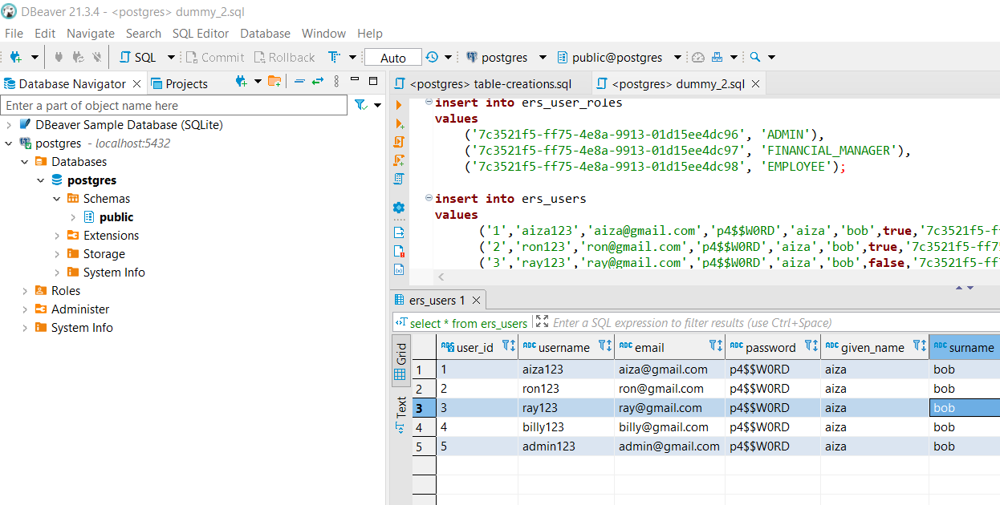

# Aiza_Foundations_Project
# Project Description
An API with an internal reimbursement system was created for this project. With this API an employee has the ability to register as a new employee in the system, 
an employee can check if they are within the system, and an admin can get access to all users, and employees can add reimbursements. The code in
intellij uses models, DAOs, Services, and Servlets to produce these outcomes in Postman.

# Technologies Used
postgresql - version 42.3.3 
avax.servlet-api - version 4.0.1 
jjwt - version 0.9.1 
jackson-core - jackson.version 
jackson-databind - jackson.version 
junit - 4.13.2 
mockito-core - 4.3.1 
tomcat7-maven-plugin - 2.2 

# Features
List of features ready and TODOs for future development 

An authenticated financial manager can approve or deny requests 
An Authenticated emplyee can access their reimbursement history 
An Admin can deactivate user accounts 
An Admin can reset a registered user's password 
System will register itself with a 3rd party PRISM application 

# To-do list:

Add features to code 
80% line coverage in all service and utility classes 
Conforming system to RESTful architecture constraints 
Log the sytem of info, error, and fatal events that occur 

# Getting Started

1. Set up Java, Maven, Postman, Gitbash, Intellij, Docker, DBeaver, and Tomcat.
2. Type in the command line in gitbash: git clone https://github.com/220207-java-enterprise/Aiza_Foundations_Project.git 
3. Open the Foundations folder in Intellij.
4. Run Docker and connect to DBeaver. 
 

5.  Open table-creations.sql and dummy2.sql in DBeaver and run all the tables and all of the queries.

6. In the local terminal in Intellij, deploy Tomcat with the command: mvn tomcat7:deploy

7. Now you can use the API in Postman.

# License
This project uses the following license: <license_name>.
